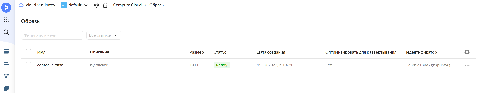
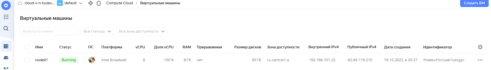

# devops-DZ5.4-Docker-Compose
# Домашнее задание к занятию "5.4. Оркестрация группой Docker контейнеров на примере Docker Compose"

## Задача 1

Создать собственный образ операционной системы с помощью Packer.

Для получения зачета, вам необходимо предоставить:
- Скриншот страницы, как на слайде из презентации (слайд 37).

## Ответ:

- Ставим утилиту Yandex Cloud `yc`

```bash
⋊> ~/DZ5.4-Docker-Compose curl https://storage.yandexcloud.net/yandexcloud-yc/install.sh | bash
  % Total    % Received % Xferd  Average Speed   Time    Time     Time  Current
                                 Dload  Upload   Total   Spent    Left  Speed
100  9739  100  9739    0     0  33258      0 --:--:-- --:--:-- --:--:-- 33352
Downloading yc 0.97.0
  % Total    % Received % Xferd  Average Speed   Time    Time     Time  Current
                                 Dload  Upload   Total   Spent    Left  Speed
100 91.2M  100 91.2M    0     0   9.9M      0  0:00:09  0:00:09 --:--:-- 10.5M
Yandex Cloud CLI 0.97.0 linux/amd64
yc is installed to /home/vk/yandex-cloud/bin/yc
vk@vkvm:~/DZ5.4-Docker-Compose$ /home/vk/yandex-cloud/bin/yc --version
Yandex Cloud CLI 0.97.0 linux/amd64
```

https://cloud.yandex.ru/docs/cli/quickstart

- Регистрируемся в консоли Yandex Cloud, получаем `OAuth`-токен
y0_AgAAAAAOtAxpAATuw************

- Инициализация профиля

```bash
vk@vkvm:~/DZ5.4-Docker-Compose$ /home/vk/yandex-cloud/bin/yc init
Welcome! This command will take you through the configuration process.
Please go to https://oauth.yandex.ru/authorize?response_type=token&client_id=1a6990aa636648e9b2ef855fa7bec2fb in order to obtain OAuth token.

Please enter OAuth token: y0_AgAAAAAOt******
You have one cloud available: 'cloud-v-n-kuzevanov' (id = b1ggidd5mp363gkiouv2). It is going to be used by default.
Please choose folder to use:
 [1] default (id = b1g12il7uurh00pne60k)
 [2] Create a new folder
Please enter your numeric choice: 1
Your current folder has been set to 'default' (id = b1g12il7uurh00pne60k).
Do you want to configure a default Compute zone? [Y/n] 
Which zone do you want to use as a profile default?
 [1] ru-central1-a
 [2] ru-central1-b
 [3] ru-central1-c
 [4] Don't set default zone
Please enter your numeric choice: 1
Your profile default Compute zone has been set to 'ru-central1-a'.
```

- Проверка профиля CLI:

```bash
vk@vkvm:~/DZ5.4-Docker-Compose$ /home/vk/yandex-cloud/bin/yc config list
token: y0_AgAAAAAOt*****
cloud-id: b1ggidd5mp363gkiouv2
folder-id: b1g12il7uurh00pne60k
compute-default-zone: ru-central1-a
```

- Создание сети

```bash
vk@vkvm:~/DZ5.4-Docker-Compose$ /home/vk/yandex-cloud/bin/yc vpc network create \
--name net \
--labels my-label=netology \
--description "First network via yc"
id: enpihrg6mef6rlp6s40q
folder_id: b1g12il7uurh00pne60k
created_at: "2022-10-19T16:08:17Z"
name: net
description: First network via yc
labels:
  my-label: netology
```

- Создание подсети в ранее созданной сети

```bash
vk@vkvm:~/DZ5.4-Docker-Compose$ /home/vk/yandex-cloud/bin/yc vpc subnet create \
--name my-subnet-a \
--zone ru-central1-a \
--range 10.1.2.0/24 \
--network-name net \
--description "First subnet via yc"
id: e9bqcic6m0o2mm0q2svn
folder_id: b1g12il7uurh00pne60k
created_at: "2022-10-19T16:09:20Z"
name: my-subnet-a
description: First subnet via yc
network_id: enpihrg6mef6rlp6s40q
zone_id: ru-central1-a
v4_cidr_blocks:
  - 10.1.2.0/24
```

- Просмотр списка всех сетей в каталоге из профиля

```bash
vk@vkvm:~/DZ5.4-Docker-Compose$ /home/vk/yandex-cloud/bin/yc vpc network list
+----------------------+---------+
|          ID          |  NAME   |
+----------------------+---------+
| enpihrg6mef6rlp6s40q | net     |
| enpo8ogvtkju5kpgklaa | default |
+----------------------+---------+
```

- Просмотр списка всех подсетей в каталоге из профиля

```bash
vk@vkvm:~/DZ5.4-Docker-Compose$ /home/vk/yandex-cloud/bin/yc vpc subnets list
+----------------------+-----------------------+----------------------+----------------+---------------+-----------------+
|          ID          |         NAME          |      NETWORK ID      | ROUTE TABLE ID |     ZONE      |      RANGE      |
+----------------------+-----------------------+----------------------+----------------+---------------+-----------------+
| b0ct342ps82bstrqjpdt | default-ru-central1-c | enpo8ogvtkju5kpgklaa |                | ru-central1-c | [10.130.0.0/24] |
| e2l1eetsh6b0v54bvtuu | default-ru-central1-b | enpo8ogvtkju5kpgklaa |                | ru-central1-b | [10.129.0.0/24] |
| e9bc17hi19sc70u20i96 | default-ru-central1-a | enpo8ogvtkju5kpgklaa |                | ru-central1-a | [10.128.0.0/24] |
| e9bqcic6m0o2mm0q2svn | my-subnet-a           | enpihrg6mef6rlp6s40q |                | ru-central1-a | [10.1.2.0/24]   |
+----------------------+-----------------------+----------------------+----------------+---------------+-----------------+
```

### Сборка образа с помощью Packer

- Установка Packer

```bash
vk@vkvm:~/DZ5.4-Docker-Compose$ wget -O- https://apt.releases.hashicorp.com/gpg | gpg --dearmor | sudo tee /usr/share/keyrings/hashicorp-archive-keyring.gpg
vk@vkvm:~/DZ5.4-Docker-Compose$ echo "deb [signed-by=/usr/share/keyrings/hashicorp-archive-keyring.gpg] https://apt.releases.hashicorp.com $(lsb_release -cs) main" | sudo tee /etc/apt/sources.list.d/hashicorp.list
vk@vkvm:~/DZ5.4-Docker-Compose$ sudo apt-get update && sudo apt-get install packer
vk@vkvm:~/DZ5.4-Docker-Compose$ packer --version
1.8.3
```

В конфигурационном файле packer `src/packer/centos-7-base.json` указываем значение следующих параметров, посмотрев их в выводе команд `yc vpc subnets list | grep -E 'ID|my-subnet-a'` и `yc config list`

- folder_id b1g12il7uurh00pne60k
- subnet_id e9bqcic6m0o2mm0q2svn
- token y0_AgAAAAAOt*****


- Проверка корректности конфигурации `packer`

```bash
vk@vkvm:~/DZ5.4-Docker-Compose$ packer validate src/packer/centos-7-base.json
The configuration is valid.
```

- Сборка образа

```bash
vk@vkvm:~/DZ5.4-Docker-Compose$ packer build src/packer/centos-7-base.json
yandex: output will be in this color.

==> yandex: Creating temporary RSA SSH key for instance...
==> yandex: Using as source image: fd88d14a6790do254kj7 (name: "centos-7-v20220620", family: "centos-7")
==> yandex: Use provided subnet id e9bqcic6m0o2mm0q2svn
==> yandex: Creating disk...
==> yandex: Creating instance...
==> yandex: Waiting for instance with id fhmnj21aknpodvi52crt to become active...
    yandex: Detected instance IP: 51.250.66.134
==> yandex: Using SSH communicator to connect: 51.250.66.134
==> yandex: Waiting for SSH to become available...
==> yandex: Connected to SSH!
==> yandex: Provisioning with shell script: /tmp/packer-shell3485238118
....
     yandex: Complete!
==> yandex: Stopping instance...
==> yandex: Deleting instance...
    yandex: Instance has been deleted!
==> yandex: Creating image: centos-7-base
==> yandex: Waiting for image to complete...
==> yandex: Success image create...
==> yandex: Destroying boot disk...
    yandex: Disk has been deleted!
Build 'yandex' finished after 6 minutes 5 seconds.

==> Wait completed after 6 minutes 5 seconds

==> Builds finished. The artifacts of successful builds are:
--> yandex: A disk image was created: centos-7-base (id: fd8dia13nd7gtsp0nt4j) with family name centos
```

- Просмотр списка созданных образов:

```bash
yc compute image list
vk@vkvm:~/DZ5.4-Docker-Compose$ /home/vk/yandex-cloud/bin/yc compute image list
+----------------------+---------------+--------+----------------------+--------+
|          ID          |     NAME      | FAMILY |     PRODUCT IDS      | STATUS |
+----------------------+---------------+--------+----------------------+--------+
| fd8dia13nd7gtsp0nt4j | centos-7-base | centos | f2euv1kekdgvc0jrpaet | READY  |
+----------------------+---------------+--------+----------------------+--------+
```



## Задача 2

Создать вашу первую виртуальную машину в Яндекс.Облаке.

Для получения зачета, вам необходимо предоставить:
- Скриншот страницы свойств созданной ВМ, как на примере 

## Ответ:

Настройка следующих идентификаторов в файле `terraform/variables.tf`:
- облака (доступен по команде `yc config list`)
- каталога (доступен по команде `yc config list`)
- образа (доступен по команде `yc compute image list`)

```bash
vk@vkvm:~/DZ5.4-Docker-Compose$ /home/vk/yandex-cloud/bin/yc compute image list
+----------------------+---------------+--------+----------------------+--------+
|          ID          |     NAME      | FAMILY |     PRODUCT IDS      | STATUS |
+----------------------+---------------+--------+----------------------+--------+
| fd8dia13nd7gtsp0nt4j | centos-7-base | centos | f2euv1kekdgvc0jrpaet | READY  |
+----------------------+---------------+--------+----------------------+--------+
vk@vkvm:~/DZ5.4-Docker-Compose$ /home/vk/yandex-cloud/bin/yc config list
token: y0_AgAAAAAOtAxpAATuwQAAAADRnsLim9Hdeg99QmGyszbA07BkNdN14BE
cloud-id: b1ggidd5mp363gkiouv2
folder-id: b1g12il7uurh00pne60k
compute-default-zone: ru-central1-a
```

### Разворачивание инфраструктуры с помощью Terraform

- Установка Terraform 

```bash
vk@vkvm:~/DZ5.4-Docker-Compose$ wget -O- https://apt.releases.hashicorp.com/gpg | gpg --dearmor | sudo tee /usr/share/keyrings/hashicorp-archive-keyring.gpg
vk@vkvm:~/DZ5.4-Docker-Compose$ echo "deb [signed-by=/usr/share/keyrings/hashicorp-archive-keyring.gpg] https://apt.releases.hashicorp.com $(lsb_release -cs) main" | sudo tee /etc/apt/sources.list.d/hashicorp.list
vk@vkvm:~/DZ5.4-Docker-Compose$ sudo apt update && sudo apt install terraform
vk@vkvm:~/DZ5.4-Docker-Compose$ terraform --version
Terraform v1.3.2
on linux_amd64
```

- Инициализация конфигурации

```bash
vk@vkvm:~/DZ5.4-Docker-Compose/src/terraform$ terraform init

Initializing the backend...

Initializing provider plugins...
- Finding latest version of yandex-cloud/yandex...
- Installing yandex-cloud/yandex v0.80.0...
- Installed yandex-cloud/yandex v0.80.0 (self-signed, key ID E40F590B50BB8E40)

Partner and community providers are signed by their developers.
If you'd like to know more about provider signing, you can read about it here:
https://www.terraform.io/docs/cli/plugins/signing.html

Terraform has created a lock file .terraform.lock.hcl to record the provider
selections it made above. Include this file in your version control repository
so that Terraform can guarantee to make the same selections by default when
you run "terraform init" in the future.

Terraform has been successfully initialized!

You may now begin working with Terraform. Try running "terraform plan" to see
any changes that are required for your infrastructure. All Terraform commands
should now work.

If you ever set or change modules or backend configuration for Terraform,
rerun this command to reinitialize your working directory. If you forget, other
commands will detect it and remind you to do so if necessary.
```

- Запуск проверки плана Terraform
```bash
vk@vkvm:~/DZ5.4-Docker-Compose/src/terraform$ terraform plan
```

- Применение Terraform плана

```bash
vk@vkvm:~/DZ5.4-Docker-Compose/src/terraform$ terraform apply
.....

Apply complete! Resources: 3 added, 0 changed, 0 destroyed.

Outputs:

external_ip_address_node01_yandex_cloud = "62.84.119.210"
internal_ip_address_node01_yandex_cloud = "192.168.101.22"
vk@vkvm:~/DZ5.4-Docker-Compose/src/terraform$ /home/vk/yandex-cloud/bin/yc compute instance list
+----------------------+--------+---------------+---------+---------------+----------------+
|          ID          |  NAME  |    ZONE ID    | STATUS  |  EXTERNAL IP  |  INTERNAL IP   |
+----------------------+--------+---------------+---------+---------------+----------------+
| fhmmbof3nlumb7ubtgar | node01 | ru-central1-a | RUNNING | 62.84.119.210 | 192.168.101.22 |
+----------------------+--------+---------------+---------+---------------+----------------+

```



